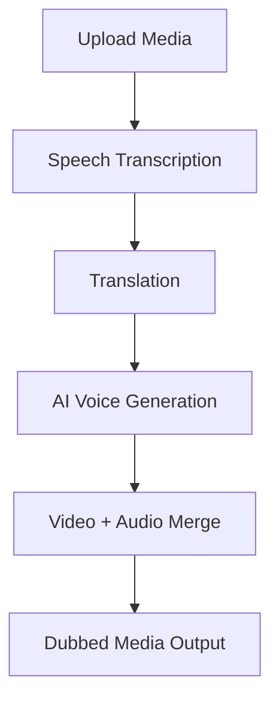

# 🎬 DubTranslate

An a web application that allows real-time translation of an audio/video file into four different languages (kor, eng, spn, jpn), where users can retrieve a dubbed version of their original file.

Users can upload **audio or video**, select a target language, and receive an automatically generated **dubbed output**.

This project demonstrates a **complete AI media pipeline** built using modern web technologies.

---

# 📌 Overview

The application automates the entire dubbing workflow:

1. Upload media
2. Extract speech
3. Translate content
4. Generate AI voice
5. Merge audio with video

This enables fast localization of media content across languages.

---

# 🚀 Features

• Upload **audio or video files**

• **Speech transcription**

• **AI translation**

• **AI voice generation**

• **Automatic video dubbing**

• **Google authentication**

• Supports **multiple languages**

• Works with both **audio and video inputs**

---

## System Pipeline

# 🏗 Architecture

Frontend (Next.js)
│
├── File Upload
├── Language Selection
└── UI Playback

↓

Backend (Next.js API Routes)
│
├── /api/transcribe
├── /api/translate
└── /api/dub

↓

External AI Services
│
├── Speech-to-Text
├── Translation
└── Text-to-Speech

↓

Media Processing
│
└── FFmpeg

↓

Final Output
│
└── Dubbed Audio / Dubbed Video

---

# 🛠 Tech Stack

## Frontend

- **Next.js**
- **React**
- **TypeScript**
- **NextAuth**

## Backend

- **Next.js API Routes**
- **Node.js**

## AI Services

- **OpenAI API**
- **Speech-to-Text**
- **AI Translation**
- **Text-to-Speech**

## Media Processing

- **FFmpeg**

## Authentication

- **Google OAuth**

---

# 📂 Project Structure

app
├── api
│ ├── auth
│ │
│ ├── transcribe
│ │ └── route.ts
│ │
│ ├── translate
│ │ └── route.ts
│ │
│ ├── dub
│ │ └── route.ts
│
├── page.tsx
├── layout.tsx
└── providers.tsx

lib
├── allowed-users.ts
└── db.ts

---

# ⚙️ Installation

## 1. Clone the repository
git clone https://github.com/YOUR_USERNAME/ai-dubbing-service.git

cd ai-dubbing-service

---

## 2. Install dependencies

npm install
npm install lucide-react

---

## 3. Install FFmpeg

Mac:

brew install ffmpeg

Verify installation:

ffmpeg -version

---

# 🔑 Environment Variables

Create a `.env.local` file in the root directory.

OPENAI_API_KEY=your_openai_api_key

NEXTAUTH_SECRET=your_secret

GOOGLE_CLIENT_ID=your_google_client_id
GOOGLE_CLIENT_SECRET=your_google_client_secret

---

# ▶️ Running the Project

Start the development server:

npm run dev

Open the application:

http://localhost:3000

---

# 🖥 Usage

1. Login with **Google**
2. Upload an **audio or video file**
3. Select a **target language**
4. Click **Generate Dub**

The system will process the media and return a dubbed result.

---

# 📦 Output Behavior

| Input | Output |
|------|------|
Audio | Dubbed audio file |
Video | Dubbed MP4 video |

---

# 🔬 Example Use Cases

• Content localization

• Educational video translation

• Podcast dubbing

• Media accessibility

• International communication

---

# 🔮 Future Improvements

Potential future features:

• Lip-sync alignment

• Subtitle generation

• Multi-speaker detection

• Voice cloning

• Real-time dubbing

• Streaming support

---

# 👨‍💻 Author

Chris Yunho Song  
Carnegie Mellon University  
Information Systems + Computer Science

---

# ⭐ Acknowledgements

This project utilizes modern AI tools and open-source media processing technologies to demonstrate automated media localization workflows.